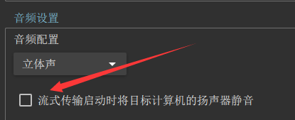

# **内部定制**

更新时间：2023-03-25 17:37

## 功能简介

- **方框自瞄：** 无任何写内存操作，稳定大号
- **网页雷达：** 无任何写内存操作，稳定大号
- **武器百科：** 可以查询所有武器的原始参数，让自己更了解每一把武器
- **内存功能：** 需要读写内存，大部分有检测，黑号娱乐，大号请勿使用
- **查询助手：** 快捷查询个人数据、处罚记录、举报记录、全区角色、信用分、活动信息等
- **必看说明**** ：**使用说明、通知公告、更新日志都会在此处更新

> 玩内存功能、可以考虑游戏机安装无盘，可预防机器码！

##

## 功能配置说明

- **绘制对象：** 根据使用的透视方案对应选择即可，融合器的话可以选择桌面或屏幕（桌面或屏幕支持任意软件的全屏绘制）
- **通讯模式：** 内置两种KMBOX通讯模式，推荐使用通讯模式B，速度更快
- **方框自瞄模式：** 内置两种方框自瞄模式，模式A全模式稳定可用；模式B绘制帧率更快（个人竞技不推荐使用）
- **游戏分辨率：** 设置一次即可，点刷新可自动获取
- **自瞄速率：** 值越小自瞄速度越慢，值越大自瞄速度越快（值区间0-1，支持随机，格式如：0.1,0.2）
- **自瞄微调：** 可调整自瞄瞄准部位的偏移
- **自瞄范围：** 若自瞄时容易换人锁，就调小自瞄范围
- **自瞄模式：**
  - **串流：** 在串流机器上监听设定的自瞄热键来启动自瞄
  - **KMBOX**** ：**可以在游戏机上监听设定的自瞄热键来启动自瞄（需要KMBOX B PRO硬件）
  - **软件：** 可以在游戏机上监听设定的自瞄热键来启动自瞄（需要游戏机启动绿色软件）
  - **红名：** 可以在游戏机上通过准心在敌人身上来启动自瞄（搭配鼠标模式：KCOM2、易键鼠、KMBOX）**[****推荐****]**
  - **静步：** 可以在游戏机上监听游戏中设定的静步热键来启动自瞄（搭配鼠标模式：KCOM2、易键鼠、KMBOX）**[****推荐****]**
  - **内置：** 可以在游戏机上中监听设定的自瞄热键来启动自瞄（搭配鼠标模式：KCOM2、易键鼠、KMBOX；不兼容WIN11 22H2等特定系统版）**[****推荐****]**
  - **自定义：** 可自行组合模式使用，如：静步+红名模式，即可使用热键触发自瞄或红名时自动自瞄
- **鼠标模式：**
  - **串流：** 在串流机器上完成自瞄过程的鼠标移动
  - **软件：** 在游戏机上完成自瞄过程的鼠标移动
  - **KMBOX**** ：**在游戏机上完成自瞄过程的鼠标移动（需要KMBOX B PRO硬件）
  - **KCOM2**** ：**在游戏机上完成自瞄过程的鼠标移动（需要KCOM2硬件，卢克赠送款或某宝售价一二十米）
  - **易键鼠：** 在游戏机上完成自瞄过程的鼠标移动（需要易键鼠硬件，某宝售价一二十米）
- **红名判断：** 只有准心在敌人身上显示红色名字时才触发自瞄（低配版掩体检测）
- **开枪间隔：** 每发射一枪的延迟
- **抬起间隔：** 每发射一枪的按下和放开的间隔
- **远程查询：** 查询助手远程查询功能可以无需扫码，游戏机登录wegame后即可直接副机远程查询

##

## 单透方案

- Moonlight串流（仅限N卡）
- Parsec串流（P2P）
- OBS采集卡
- 融合器

## 自瞄方案

- 串流机自瞄：
  - Moonlight串流
- 游戏机自瞄：
  - KMBOX B PRO
  - 红名
  - 软件
  - 静步
  - 内置

> 自瞄速度太慢解决方案（以下三个方案，选择都能解决）：  
1、自瞄速率(值越大速度越快，小数值区间：0-1)  
2、调整游戏鼠标移动速度（调高）  
3、鼠标DPI（调高）  

自瞄锁定后会晃解决方案（以下三个方案，选择都能解决）：  
1、调低自瞄速率(值越小速度越慢)  
2、调整游戏鼠标移动速度（调低）  
3、鼠标DPI（调低）  

##

## 常见问题

**串流虚拟问题：** 有人串流可能会出虚拟输入，有的人就不会出，如果出虚拟输入的可以尝试使用同一个系统版本（cfer提供的方案，具体自行测试）

**狙击镜自瞄问题：** 开镜后准心和敌人距离也会相应变大，所以需要的瞄准范围也会更大（如果锁人后会晃鼠标，参照自瞄方案锁定后会晃的方案去解决）

**共享雷达速度问题：** 可以调整软件的推送延迟配置项。因为共享外网雷达需要联网传输数据，受自身网络环境速度影响以及服务器影响，现在一般自身网络环境都是大带宽环境了，所以影响不大。影响较大的是外网服务器的带宽，若有不满足速度的土豪客户，可以联系部署私人共享雷达服务器

**共享雷达切换高亮对象：** 有2种方案：

- 昵称高亮：?name=玩家昵称关键词（如：http://127.0.0.1:7788/radar?name=张三）
- ID高亮：?id=玩家编号（如：http://127.0.0.1:7788/radar?id=5）

若什么都不加则对象是自己（http://127.0.0.1:7788/radar）

**自瞄时准星追不上：** 自瞄速率值调大

**自瞄模式和鼠标模式是什么意思：** 自瞄=自瞄模式+鼠标模式，自瞄模式=通过什么介质监听何时触发自瞄动作，鼠标模式=触发自瞄后通过什么介质控制鼠标移动到目标对象位置

**自瞄模式的红名和红名判断的区别：** 自瞄模式里面有个红名选项，这个可以实现红名时自动自瞄，不需要按热键来触发自瞄。而红名判断(自瞄前)，是针对热键来触发自瞄的时候先进行一个红名判断，也就是说按了热键触发自瞄后，准星也得在人身上，当这两个条件都满足才会触发自瞄。

**有没有办法不隔墙锁人：** 目前解决隔墙锁人的方案是自瞄模式使用红名模式，或者使用热键自瞄的用户可勾选自瞄前的红名判断选项

**红名自瞄瞄人后拉不回来：** 因为你调得太锁了，自瞄速率值调小一点，不要那么锁就能拉回来了

**KMBOX**** 自瞄没效果：**确认KMBOX接线正常、驱动正常、连接正常，如果是鼠标热键触发自瞄，就把鼠标插入KM的鼠标口，如果是键盘触发自瞄，就把键盘插入KM的键盘口，否则没有效果！

**KMBOX**** 突然不自瞄：**3种方案：

	
- 重启游戏机；

- 网盘内下载uPyCraft工具，然后根据下图所示，点击Tools菜单下的选Serial菜单下的自己KMBOX对应的串口号，连接成功后，点击右侧的断开连接即可。若问题还未得到解决，请检测自己的KMBOX设备是否正常

- 重新拔插各个接口后重试。

**Moonlight串流后游戏机没声音：**

不勾选此项配置：

**Moonlight串流602错误：**

Moonlight设置中不勾选此项配置：
还有一种解决方案，安装更低版本的GeForce\_Experience（[//us.download.nvidia.com/GFE/GFEClient/3.23.0.74/GeForce_Experience_v3.23.0.74.exe](https://us.download.nvidia.com/GFE/GFEClient/3.23.0.74/GeForce_Experience_v3.23.0.74.exe)）

## **下载地址**
<https://wwrr.lanzoul.com/b0f4jvb9a>

密码:nbdz

##

## **黑号购买**
高质量黑号，可以用来体验内存功能、娱乐功能

<http://shop.ksfka.com/links/9D82CC0C>

<https://www.lklfk.com/links/EF12D6D9>

## CF防盗科普

[CF防盗&安全科普](../docLink)

##

## CF辅助剖析

[辅助剖析](../FromPaste)

## 更新日志

【2023-03-31】【V2.4.1】更新内容：

- 新增静步自瞄、硬件自瞄模式（详见配置说明）
- 新增查询助手远程查询功能（详见配置说明）
- 新增自瞄模式自定义功能（详见配置说明）

【2023-03-25】【V2.4】更新内容：

- 新增KCOM2、易键鼠2个自瞄鼠标模式（需要有相应硬件）
- 新增网页雷达显示视野功能
- 新增共享外网雷达时短网址转换功能
- 新增队伤模式（队友透视）
- 新增自瞄部位自定义随机功能
- 新增多个自瞄相关算法

- 自瞄范围算法
- 自瞄目标算法
- 自瞄锁定算法
- 自瞄线性插值

- 修改自瞄速率

- 速率值机制调整，值区间：0-1，数值越大自瞄速度越快
- 速率值支持区间随机（格式如：0.1,0.2）

- 优化自瞄微调算法
- 优化网页雷达

【2023-03-14】【V2.3.1】更新内容：

- 新增红名自瞄模式
- 新增开枪前红名判断
- 新增靶场方框自瞄
- 新增游戏已运行时启动软件将自动初始化
- 新增共享外网雷达时可选择队友生成共享链接
- 新增DMA测速功能
- 修复部分客户反应雷达地图白的问题
- 优化部分功能

【2023-03-11】【V2.3】更新内容：

- 新增查询助手模块，功能如下：
  - 处罚记录
  - 举报记录
  - 账号信息
  - 安全分记录
  - 全区角色
  - 腾讯信用分
  - 活动信息
- 新增自定义绘制颜色、人物C4颜色
- 新增方框自瞄显示C4功能
- 优化方框绘制和自瞄速度性能提升30%

【2023-03-08】【V2.2】更新内容：

- 优化串流透锁，性能大幅度提升
- 新增绘制对象功能，支持包括但不限于如月光串流、parsec串流、obs采集卡、融合器等
- 修复雷达地图沙漠灰阵营有时候没切换成功BUG
- 修复雷达地图沙漠灰反馈的位置不准问题
- 新增雷达C4掉落也可显示
- 新增雷达部分配置项提示
- 新增雷达访问记录
- 新增内存功能灵魂瞬移
- 新增COM口快捷查看

【2023-02-21】【V2.0】更新内容：

- 网页雷达
  - 新增爆破全地图（以前只能排位8图）
- 自瞄
  - 增加软件自瞄功能
  - 增加自瞄自动开枪功能
  - 增加自瞄随机部位功能
- 修复BUG，提升性能，优化功能
- 界面调整
